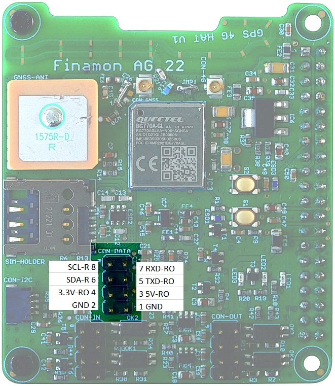

# gps4ghat
**GPS_4G_HAT_BG77X** 

**Library**

Python drivers for Finamon GPS 4G shield onboard devices and peripheral interfaces
- Quectel BG77/BG770 4G Modem
- Accelerometer MC3419/MC3479
- Other shield HW parts: inputs/outputs, button, LED
  
**Examples**

Basic examples showing how to work with Finamon GPS 4G shield onboard devices using Python.
- demo_echo.py
- demo_geofences.py
- demo_GPS_4G_HAT.py
- demo_mqtt.py 

**Prerequisites**
- install pynmea2
  
